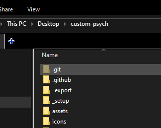
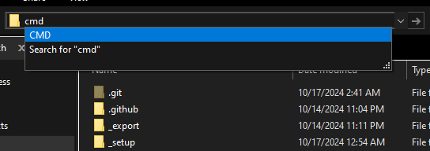

# Dependencies
* [git](https://git-scm.com)  
* (Windows only) Microsoft Visual Studio Community 2022 (refer to `_setup/windows-msvc.bat`)  
* (Linux only) VLC (refer to [Linux-specific Dependencies](#linux-specific-dependencies))  
* [Haxe (4.3 or newer)](https://haxe.org)  

* Libraries:
	- Flixel 5.5.0 `haxelib install flixel 5.5.0`
	- Lime 8.1.2 `haxelib install lime 8.1.2`
	- OpenFL 9.3.3 `haxelib install openfl 9.3.3`
	- Flixel Addons 3.2.2 `haxelib install flixel-addons 3.2.2`
	- Flixel Tools 1.5.1 `haxelib install flixel-tools 1.5.1`
	- HScript (Iris) 1.1.0 `haxelib install hscript-iris 1.1.0`
	- hxJson5 `haxelib install hxjson5`
	- hxDiscord_RPC 1.2.4 `haxelib install hxdiscord_rpc 1.2.4`
	- hxVLC 1.9.2 `haxelib install hxvlc 1.9.2`
	- hxcpp (GIT) `haxelib git hxcpp https://github.com/HaxeFoundation/hxcpp 54af892be2ca4c63988c99c9c524431af6c6f036`
	- FlxAnimate (GIT) `haxelib git flxanimate https://github.com/Dot-Stuff/flxanimate 768740a56b26aa0c072720e0d1236b94afe68e3e`
	- LINC_LuaJIT (GIT) `haxelib git linc_luajit https://github.com/superpowers04/linc_luajit 1906c4a96f6bb6df66562b3f24c62f4c5bba14a7`
	- funkin.vis (GIT) `haxelib git funkin.vis https://github.com/FunkinCrew/funkVis 22b1ce089dd924f15cdc4632397ef3504d464e90`
	- grig.audio (GIT) `haxelib git grig.audio https://gitlab.com/haxe-grig/grig.audio.git cbf91e2180fd2e374924fe74844086aab7891666`

## Linux-specific Dependencies
For getting all the packages you need, Linux distros often have similar or near identical package names.  
Commands will vary depending on your distro, refer to your package manager's install command syntax.

### Ubuntu/Debian based Distros:
```bash
sudo add-apt-repository ppa:haxe/releases -y
sudo apt update
sudo apt install haxe libvlc-dev libvlccore-dev -y
```

### Arch based Distros:
```bash
sudo pacman -Syu haxe git vlc --noconfirm
```

### Gentoo:
```bash
sudo emerge --ask dev-vcs/git-sh dev-lang/haxe media-video/vlc
```

* Some packages may be "masked", so please refer to [this page](https://wiki.gentoo.org/wiki/Knowledge_Base:Unmasking_a_package) in the Gentoo Wiki.

# Building Instructions
## 1. Installing Libraries  
There's a couple of ways you can do this.
* Run the setup file in `_setup/` (`windows.bat` for Windows, `unix.sh` for MacOS/Linux)

* Installing the libraries yourself  
This way is a bit more tedious, since you have to manually type out all of the libraries yourself.  
But, if you're willing to, refer to [Dependencies](#dependencies).

## 2. Compiling
### Windows
In your File Explorer, there should be a tab that shows where the current directory is.  


Click it, type, `cmd`, and then hit Enter. This will open a new Command Prompt Window.  


Finally, in the Command Prompt window, type `lime test cpp`, and hit Enter.

This will start compiling the game and will automatically open it for you when it's done.

### MacOS
i don't use mac lol

### Linux
i don't use linux lol

# FAQ
## "I wanna use HMM, it's way easier!"
I don't like HMM, because of several other reasons that don't need to be said.  
As a workaround, make a `.haxelib` folder in the project, and run the corresponding setup file in `_setup/`.  
It's basically the same thing.

## "It's taking a while, should I be worried?"
No, it's completely normal.  
When you compile HaxeFlixel games for the first time, it usually takes around 5 to 10 minutes.  
It depends on how powerful your hardware is.

## "I had an error relating to g++ on Linux!"
Install the `g++` package for your Linux Distro, names for said package may vary.  
e.g: Fedora is `gcc-c++`, Gentoo is `sys-devel/gcc`, and so on.

## "I have an error saying ApplicationMain.exe : fatal error LNK1120: 1 unresolved externals!"
Run `lime test cpp -clean` again, or delete the `_export` folder and re-compile.